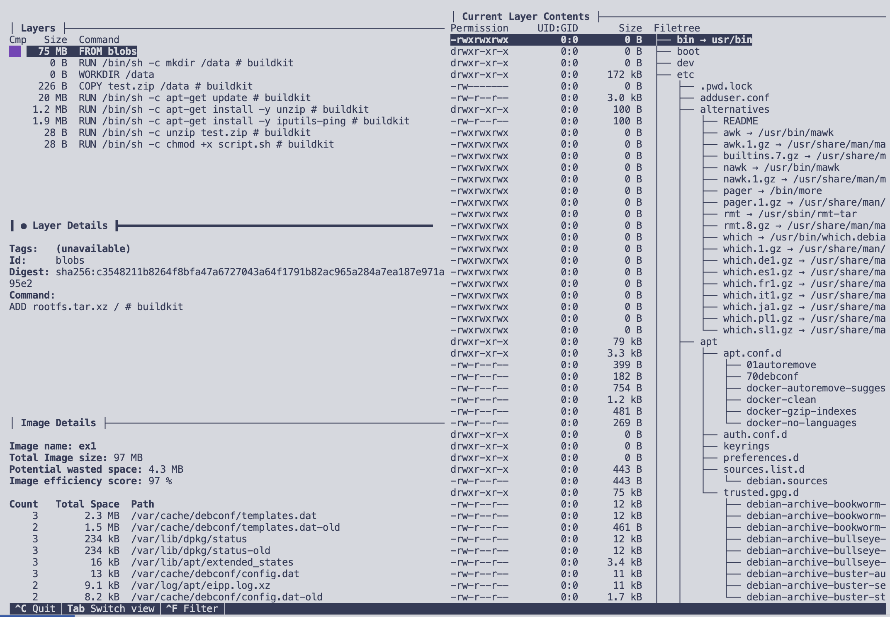
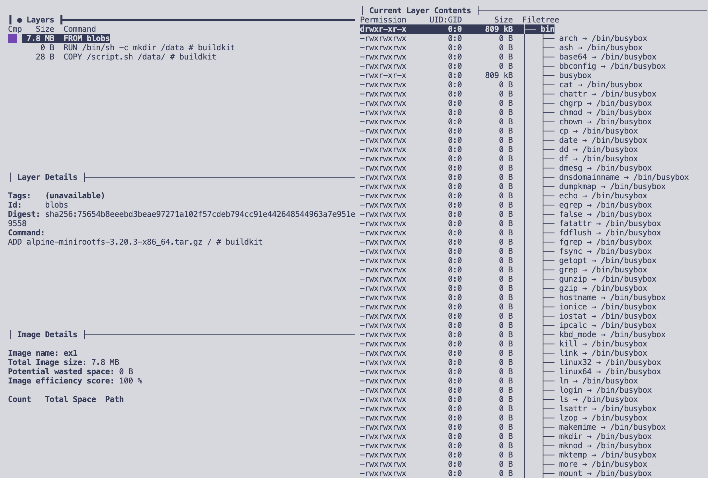

# Amélioriation du Dockerfile

Combiner les commandes RUN  et supprimer le cache APT (ou ne pas le générer):
```Dockerfile
RUN apt-get update && apt-get install -y unzip iputils-ping && \
    unzip test.zip && chmod +x script.sh && \
    apt-get clean && rm -rf /var/lib/apt/lists/*
```

Utiliser une image de base plus légère, comme Alpine Linux :
```Dockerfile
FROM alpine:latest
```

Utiliser une image `builder` avec unzip afin de ne pas avoir à installer unzip dans l'image finale:
```Dockerfile
FROM alpine:latest as builder
RUN apk add --no-cache unzip
COPY test.zip /tmp/test.zip
RUN unzip /tmp/test.zip /tmp/

FROM alpine:latest
COPY --from=builder /tmp/script.sh /data/

CMD ["/bin/sh", "/tmp/script.sh"]
```

Le ping de Alpine n'est pas le même que celui de Debian, il ne peut pas ping https par exemple (mauvaise pratique de toute façon).

# Avant


# Après
